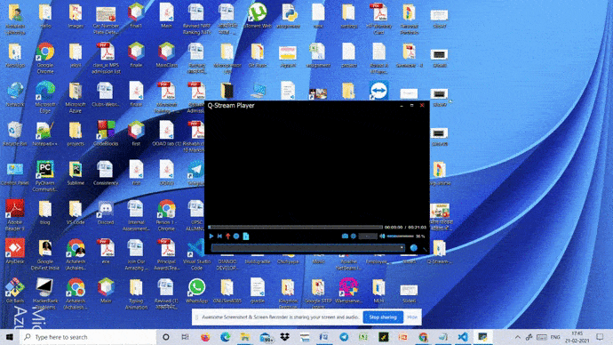

 # About Q-Stream
[](https://github.com/Q-Stream/Q-Stream) &nbsp;
[](https://github.com//Q-Stream/Q-Stream/stargazers)&nbsp;
[](https://github.com/Q-Stream/Q-Stream/issues)&nbsp;
[](https://img.shields.io/github/contributors/Q-Stream/Q-Stream) &nbsp;
[](https://github.com/Q-Stream/Q-Stream/network/members) &nbsp;
[](https://www.python.org/)
## Demo


## Features
Q-Stream is an Media Player with key features:
1. It can support any online video from numerous platforms like Youtube ,Vimeo ,Twitch ,Veoh and many more.
2. Can be adapted on various devices.
3. Allows you to organise your multimedia collection

## Find more here :
       1. Purpose and scope
       2. What will You Need?
       3. For Ubuntu
       4. Using Q-Stream
       5. Resources
       6. FAQ

## Purpose and Scope :

Q-Stream provides alternative to Media Players for playing videos over the internet for a better experience. You can run it on any device (web as well as Mobile) . Currently, you can use it as a desktop application for uninterrupted streaming!

## What will You Need?
<br>
 * [Python](https://www.python.org/downloads/)
 * [PyQt5](https://pypi.org/project/PyQt5/#files) 
 * [Flask](https://pypi.org/project/Flask/#files)
 * [Streamlink](https://streamlink.github.io/install.html)
 * [PyAutoGUI](https://pypi.org/project/PyAutoGUI/#files)

RUN ```Player.py```

You can get it from the links specified or run ```pip install -r requirements.txt```

## For Ubuntu-
  1. Run 
      ```
      sudo apt install gstreamer1.0-plugins-bad-faad
      sudo apt-get install gstreamer1.0-libav
      sudo apt-get install --reinstall libxcb-xinerama0
      ```

## Using Q-Stream -
You can start by **forking and cloning** this repository on your local machine using 

```https://github.com/Q-Stream/Q-Stream.git```


Make sure you download all the files stated in requirements.
Then you are good to start!

## Resources 📕 -
<br>
[Icons](https://icons8.com/) | [PyQt5](https://www.youtube.com/watch?v=Vde5SH8e1OQ&list=PLzMcBGfZo4-lB8MZfHPLTEHO9zJDDLpYj) | [Streamlink](https://streamlink.github.io/api_guide.html) | [Video Encoder(Windows)](https://files3.codecguide.com/K-Lite_Codec_Pack_1560_Basic.exe) | [Qt Designer](https://build-system.fman.io/qt-designer-download)

## How to Contribute? 💥
<br>
- If you wish to contribute kindly check the [CONTRIBUTION.md](https://github.com/Q-Stream/Q-Stream/blob/master/CONTRIBUTION.md)🤝

## Project Admins 🌟✨

<table>
	<tr>
    <td align="center">
            <a href="https://github.com/VedantKhairnar">
              <br />
              <sub><b>Vedant Khairnar</b></sub>
            </a><br/>
   </td>
   <td align="center">
            <a href="https://github.com/Anmol-tech">
              <br />
              <sub><b>Anmol Sharma</b></sub>
            </a><br/>
   </td>
  </tr>
</table>

## Contributors 🌟

Thanks goes to these wonderful people ✨:

<table>
	<tr>
    <td align="center">
            <a href="https://github.com/VedantKhairnar">
              <br />
              <sub><b>Vedant Khairnar</b></sub>
            </a><br/>
   </td>
   <td align="center">
            <a href="https://github.com/Anmol-tech">
              <br />
              <sub><b>Anmol Sharma</b></sub>
            </a><br/>
   </td>
   <td align="center">
            <a href="https://github.com/Pranjal-2001">
              <br />
              <sub><b>Pranjal Patil</b></sub>
            </a><br/>
   </td>
   <td align="center">
            <a href="https://github.com/akrish4">
              <br />
              <sub><b>Ananthakrishnan Nair RS </b></sub>
            </a><br/>
   </td>
   <td align="center">
            <a href="https://github.com/Swastik1710">
              <br />
              <sub><b>Swastik Raj Singh</b></sub>
            </a><br/>
   </td>
   <td align="center">
            <a href="https://github.com/tusharnankani">
              <br />
              <sub><b>Tushar Nankani</b></sub>
            </a><br/>
   </td>
   <td align="center">
            <a href="https://github.com/Ankit1598">
              <br />
              <sub><b>Ankit Chaudhari </b></sub>
            </a><br/>
   </td>
   <td align="center">
            <a href="https://github.com/qwerty-123456-ui">
              <br />
              <sub><b>qwerty935</b></sub>
            </a><br/>
   </td>
  </tr>
</table>

## Open-source Programs We are a part of 👾

### `DWoC(Devscript Winter of Code)`
<div style="display: flex; align-items: center; justify-content: space-between;">
<p>
Winter of Code is an open-source program envisioned by DevScript that helps understand the paradigm of Open Source contribution. It aims to bring students into the world of open source development and see the power of unified problem solving in real time.</p>
<br>
</div>

## FAQs -

1. What options does Q-Stream provide?

It provides and efficient way to stream any videos online for a greater experience. You can save history and mark "favourite" for future convenience.

2. Is streaming videos on Q-Stream for free?

Yes, it is free as it is entirely an open source project.

3. What is the next step of Q-Stream?

We are planning to develop a crossplatform version for Linux and macOS.                                    

4. Any more questions? &nbsp;<br>
  Contact **Project Admins**.                                    
